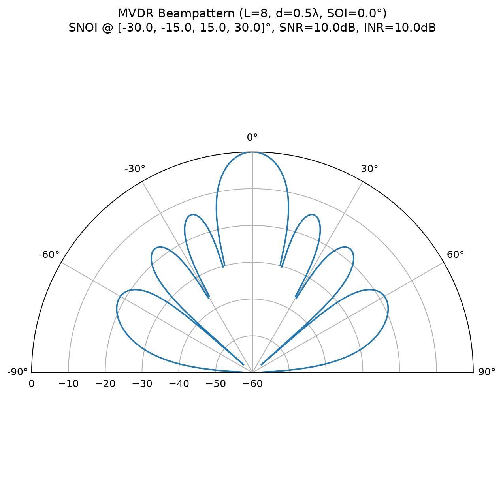

# Mobile and satellite radio communication systems

Python study simulations prepared around radio-communication topics. The runnable examples focus on mobile-network scenarios: base-station deactivation, cell-range expansion in a macro/micro network, and Massive MIMO MVDR beamforming. They are educational models, not network-planning or operational-control software.

[Source](https://github.com/haribo841/Mobile-and-satellite-radio-communication-systems) | [Scenario guide](docs/SCENARIOS.md) | [License](LICENSE.txt) | [Report an issue](https://github.com/haribo841/Mobile-and-satellite-radio-communication-systems/issues)

## Example output



Actual output from the existing MVDR script: 8 elements, half-wavelength spacing, desired signal at 0 degrees, and interferers at -30, -15, 15, and 30 degrees. It is a normalized simulation plot, not an antenna measurement. The [scenario guide](docs/SCENARIOS.md) explains the inputs and model limitations.

## Included simulations

| Scenario | Script | Output |
| --- | --- | --- |
| Base-station deactivation | [Base_Station_Dealtivation.py](./Base%20Station%20Dealtivation/Base_Station_Dealtivation.py) | Compares traffic load, power use, and energy efficiency for one or two active stations. |
| Cell-range expansion | [Cell_Range_Extension.py](./Cell%20Range%20Extension/Cell_Range_Extension.py) | Calculates a macro/micro heterogeneous-network scenario and plots average throughput for selected CRE values. |
| Massive MIMO | [Massive_MIMO.py](./Massive%20MIMO/Massive_MIMO.py) | Interactively plots an MVDR beam pattern for a uniform linear array. |

## Quick start

The quickest example needs only Python 3 and the standard library. There is no installer or binary release:

~~~powershell
git clone https://github.com/haribo841/Mobile-and-satellite-radio-communication-systems.git
cd Mobile-and-satellite-radio-communication-systems
python ".\Base Station Dealtivation\Base_Station_Dealtivation.py"
~~~

Its fixed-seed example prints the following comparison:

| Existing model's scenario | Total power | Energy efficiency |
| --- | --- | --- |
| Two active stations | 922.6 W | 0.0209 Mbit/J |
| One active station, one sleeping | 563.3 W | 0.0342 Mbit/J |

See the [complete captured output](docs/examples/base-station-output.txt). These are results of the supplied simplified formulas, not validated power savings for a real network.

## Reproduce the charts

The two plotting examples require NumPy and Matplotlib. The following Windows commands save the original figures without opening GUI windows:

```powershell
python -m venv .venv
.\.venv\Scripts\python.exe -m pip install -r docs/requirements-examples.txt
.\.venv\Scripts\python.exe docs/render_examples.py
.\.venv\Scripts\python.exe -m unittest discover -s docs -p "test_*.py" -v
```

The renderer uses the scripts' seeds and default inputs, saves two PNGs, and records versions, the random generator, inputs, results, and source hashes in [results.json](docs/examples/results.json). It does not change their formulas. Fifteen regression checks cover the generated artifacts, numerical examples, repeatable sampling, and CLI behavior, not the scientific validity of the models.

The CRE example now uses NumPy's `default_rng(42)` with PCG64. Its sample and saved chart differ from the earlier legacy-generator example, although the seed remains 42. See the [reproducibility notes](docs/SCENARIOS.md#reproducibility).

## Supported platform

Verified on Windows with Python 3.12.14, NumPy 2.5.3, and Matplotlib 3.11.2. Other platforms have not been tested. The capture script uses the non-interactive Agg backend; running the original plotting scripts directly requires a graphical Matplotlib backend.

## Scope and limitations

The values, formulas, and random seeds belong to compact coursework examples. They do not model all propagation effects, scheduling constraints, protocol behavior, or regulatory requirements. The CRE example has inconsistent association/rate conditions, and the MVDR SNR input does not affect its current weight calculation. These limitations are explained in the guide, not silently corrected in a documentation update. Validate and extend the model before using any result for an engineering decision.

## Documentation, license, and support

- [Scenario guide](docs/SCENARIOS.md)
- [Previous README archive](docs/archive/README-2026-09-16.md)
- [License](LICENSE.txt)
- Report a reproducible issue with the script name, Python version, and dependency versions.
