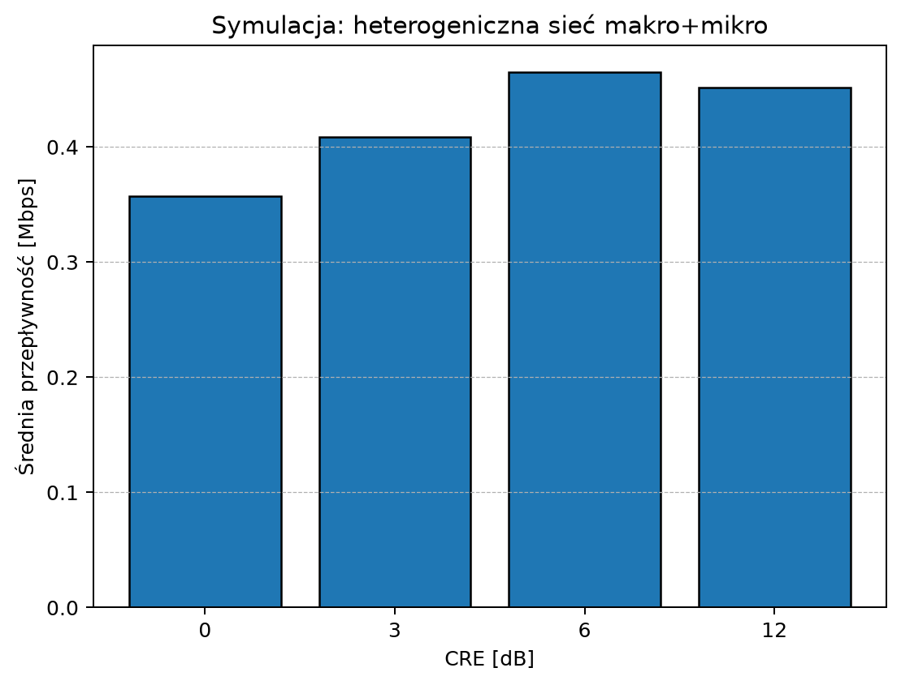

# Scenario guide

## Base-station deactivation

[Base_Station_Dealtivation.py](../Base%20Station%20Dealtivation/Base_Station_Dealtivation.py) creates a repeatable three-user example by seeding Python's random generator. It compares:

- two active base stations; and
- one active station with the second station in sleep mode.

The script prints SNR values, requested rates, bandwidth occupancy, power, and a simple energy-efficiency ratio. It is a compact comparison model, not a radio-resource-management implementation.

The [captured console output](examples/base-station-output.txt) uses the script's existing `random.seed(0)`. Its power model is the expression currently in the source, `460 + 4.2 * load`, with 100 W for the sleeping station. No calibration against hardware or measurements is implied. The code does not reject a scenario whose calculated bandwidth demand exceeds capacity.

## Cell-range expansion

[Cell_Range_Extension.py](../Cell%20Range%20Extension/Cell_Range_Extension.py) simulates a macro/micro topology with randomly distributed users and evaluates selected cell-range-expansion values. It uses NumPy for calculation and Matplotlib to draw a bar chart of average throughput.

The calculation uses free-space path loss and simplified bandwidth allocation. It should be treated as a learning visualization rather than a calibrated coverage prediction.



The checked-in chart uses 20 users, NumPy seed 42, a 1,000 m macro/micro separation, a 3.5 GHz carrier, and a 5 MHz bandwidth parameter. The original bandwidth allocation uses fractions of that bandwidth, not 5 MHz per user.

| CRE bias | Existing script's mean rate |
| --- | --- |
| 0 dB | 0.357243 Mbit/s |
| 3 dB | 0.408633 Mbit/s |
| 6 dB | 0.464587 Mbit/s |
| 12 dB | 0.451583 Mbit/s |

Important source-level limitations: CRE is added both to association and to the micro-cell signal power used in the rate calculation. The macro rate is enabled by `Pm >= Ps`, while micro association uses the biased power. A user can therefore contribute both macro and micro rates for a positive bias. This chart faithfully reproduces that implementation; it is not evidence of a physically correct CRE optimization. The documentation update does not alter the algorithm.

## Massive MIMO MVDR beamforming

[Massive_MIMO.py](../Massive%20MIMO/Massive_MIMO.py) calculates and plots an MVDR beam pattern for a uniform linear array. At launch it asks for the number of elements, element spacing, desired-signal direction, interfering directions, SNR, and INR. Press Enter at a prompt to keep the documented defaults.

| Input | Default captured in the README |
| --- | --- |
| Array elements | 8 |
| Element spacing / wavelength | 0.5 |
| Desired-signal angle | 0 degrees |
| Interferer angles | -30, -15, 15, 30 degrees |
| SNR / INR | 10 dB / 10 dB |
| Angular scan | -90 to +90 degrees, 361 samples |

The [saved plot](images/mvdr-defaults.png) is normalized to its maximum of 0 dB and displayed over a -60 to 0 dB radial range. It is not an absolute radiation-power measurement. The current source computes `soi_power` from SNR but does not use it when forming the covariance matrix or weights; changing SNR alone will not change this normalized pattern. INR does enter the interference covariance matrix.

## Reproducibility

The repository now includes real generated figures, the [capture script](render_examples.py), [direct dependency versions](requirements-examples.txt), and a [machine-readable result record](examples/results.json). The dependency file pins NumPy and Matplotlib for the example environment; it is not a complete transitive dependency lock.

Run from the repository root:

```powershell
python docs/render_examples.py
python -m unittest discover -s docs -p test_examples.py -v
```

These commands assume the listed dependencies are installed in the selected interpreter. To preserve the checked-in captures when experimenting, pass a separate output directory, for example `python docs/render_examples.py --output-dir .\out\radio-preview`. The directory receives `images/` and `examples/` subdirectories.

The renderer executes the existing scripts, temporarily disables `plt.show()`, and supplies empty responses to the MVDR prompts to select defaults. It checks for finite numeric outputs and hashes each simulation source before and after capture. It does not rewrite the simulations or change the user's installed Python environment.

Verified on Windows on 2026-09-25 using Python 3.12.14, NumPy 2.5.3, and Matplotlib 3.11.2 with Agg. Tests cover PNG generation, expected result structure, the default MVDR settings and normalization, and the console-output sections. They do not validate all parameter combinations or the physical correctness of the coursework models.
